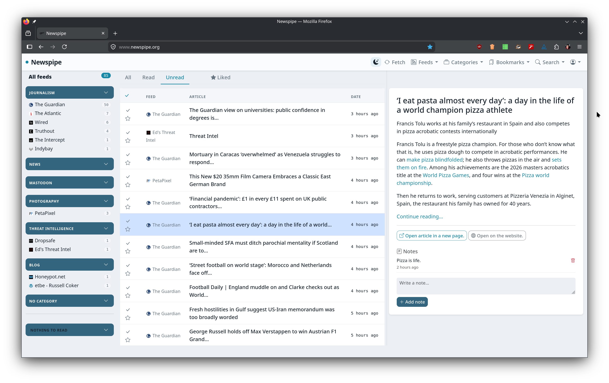

<div align="center">

# 📰 Newspipe

**A self-hosted web news aggregator — own your feeds, your data, and your reading.**

[](https://www.gnu.org/licenses/agpl-3.0.html)
[](https://www.python.org)

[](https://github.com/cedricbonhomme/newspipe/commits/master)
[](https://github.com/sponsors/cedricbonhomme)

Built with [Flask](http://flask.pocoo.org) · [asyncio](https://www.python.org/dev/peps/pep-3156/) · [SQLAlchemy](http://www.sqlalchemy.org)



</div>

---

## ✨ Features

- 👥 **Multi-user** — a single Newspipe instance serves many users
- 🔌 **API** — manage feeds programmatically and plug in your own crawler
- 📦 **Data liberation** — export and import your whole account as JSON
- 🔁 **OPML** — import and export your feeds with OPML files
- 🔍 **Search & favorites** — find and bookmark the articles that matter
- 💤 **Inactive feed detection** — keep your feed list clean
- 🔖 **Bookmarks** — full bookmark management, with import from Pinboard
- 🔐 **LDAP** — optional LDAP authentication (see the example config)
- 🌗 **Themes** — light and dark interfaces out of the box

## 🚀 Quick start

Assuming you already have `git`, `poetry`, `npm`, and `Python >= 3.10` installed:

```bash
git clone https://github.com/cedricbonhomme/newspipe
cd newspipe/
npm ci
poetry install
poetry shell
pybabel compile -d newspipe/translations
export NEWSPIPE_CONFIG=sqlite.py
flask db_init
flask create_admin --nickname <nickname> --password <password>
flask run --debug
```

Then open <http://127.0.0.1:5000> and sign in. 🎉

### 🐘 Using PostgreSQL

Customize the provided example configuration file (`instance/config.py`):

```bash
sudo apt-get install postgresql
cp instance/config.py instance/postgresql.py
vim instance/postgresql.py  # customize it
export NEWSPIPE_CONFIG=postgresql.py
flask db_create
flask db_init
```

For production, serve Newspipe with [Gunicorn](https://gunicorn.org) or `mod_wsgi`.

### 🔄 Updates and migrations

```bash
cd newspipe/
git pull origin master
poetry install
poetry run flask db upgrade
poetry run pybabel compile -d newspipe/translations
```

## ⏱️ Retrieving feeds automatically

A dedicated Flask command runs the RSS/Atom feed importer. Schedule it with cron,
for example every three hours:

```bash
0 */3 * * * poetry run flask fetch_asyncio
```

When using cron it is usually best to be explicit about the command location:

```bash
0 */3 * * * FLASK_APP=app.py /home/cedric/.cache/pypoetry/virtualenvs/newspipe-19mdZ4UL-py3.12/bin/flask fetch_asyncio
```

## 📄 License

[Newspipe](https://github.com/cedricbonhomme/newspipe) is released under the
[GNU Affero General Public License v3](https://www.gnu.org/licenses/agpl-3.0.html).

## 💛 Donations

If you enjoy Newspipe, you can support its development:

[](https://github.com/sponsors/cedricbonhomme)

…or with Bitcoin: `bc1q56u6sj7cvlwu58v5lemljcvkh7v2gc3tv8mj0e`

Thank you! 🙏

## 📬 Contact

Made by [Cédric Bonhomme](https://www.cedricbonhomme.org).
