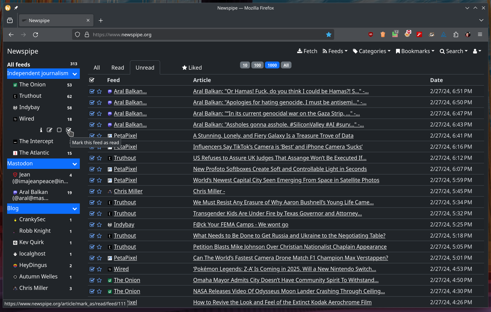

# Newspipe

[](https://builds.sr.ht/~cedric/newspipe)

## Presentation

[Newspipe](https://git.sr.ht/~cedric/newspipe) is a web news aggregator.



Newspipe is written in Python. The core technologies are
[Flask](http://flask.pocoo.org),
[asyncio](https://www.python.org/dev/peps/pep-3156/) and
[SQLAlchemy](http://www.sqlalchemy.org).

For reporting issues, visit the tracker here:
https://todo.sr.ht/~cedric/newspipe

For contributions, use the mailing list to send your patches:
https://lists.sr.ht/~cedric/newspipe


## Main features

* multiple users can use a Newspipe instance;
* an API to manage feeds (you can connect your own crawler);
* data liberation: export and import your account with a JSON file;
* export and import feeds with OPML files;
* search and favorite articles;
* detection of inactive feeds;
* share articles on Pinboard, Reddit and Twitter;
* management of bookmarks (with import from Pinboard).


## Deployment

Newspipe is really easy to deploy.

Assuming you have already installed ``git``, ``npm``, ``poetry``,  and
``Python >= 3.8``, you just have to do the following:

```bash
$ git clone https://git.sr.ht/~cedric/newspipe
$ cd newspipe/
$ npm install
$ poetry install
$ export Newspipe_CONFIG=sqlite.py
$ poetry shell
$ pybabel compile -d newspipe/translations
$ python manager.py db_create
$ python manager.py create_admin <nickname> <password>
$ python runserver.py
  * Running on http://127.0.0.1:5000/ (Press CTRL+C to quit)
```

If you want to use PostgreSQL you can customize
the provided example configuration file (``instance/production.py``):

```bash
$ sudo apt-get install postgresql
$ cp instance/production.py instance/postgresql.py
$ vim instance/postgresql.py # customize it
$ export Newspipe_CONFIG=postgresql.py
```

For production you can use [Gunicorn](https://gunicorn.org) or ``mod_wsgi``.


## License

[Newspipe](https://git.sr.ht/~cedric/newspipe) is under the
[GNU Affero General Public License version 3](https://www.gnu.org/licenses/agpl-3.0.html).


## Contact

[Cédric Bonhomme](https://www.cedricbonhomme.org)
