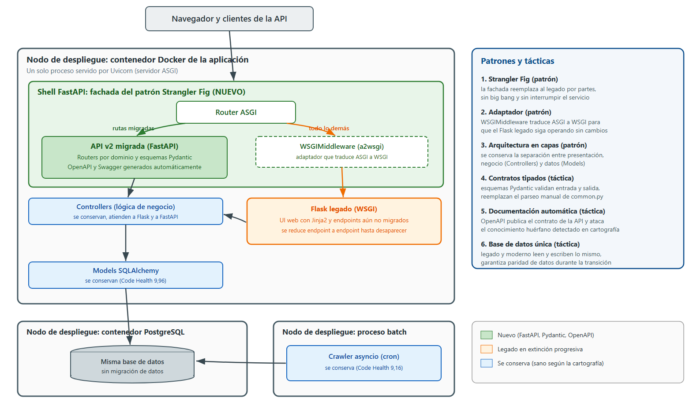
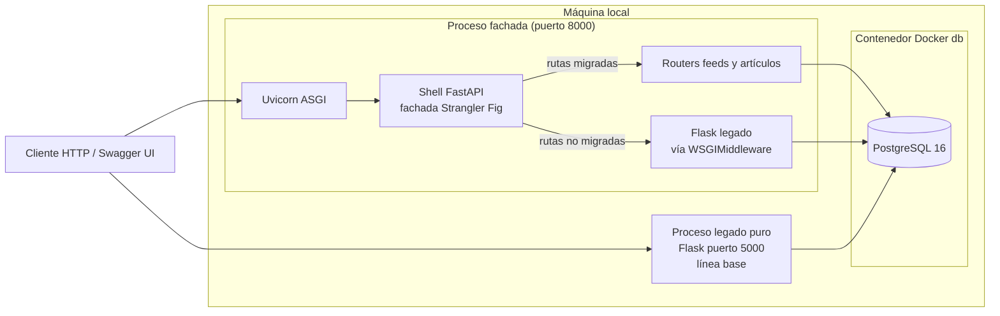
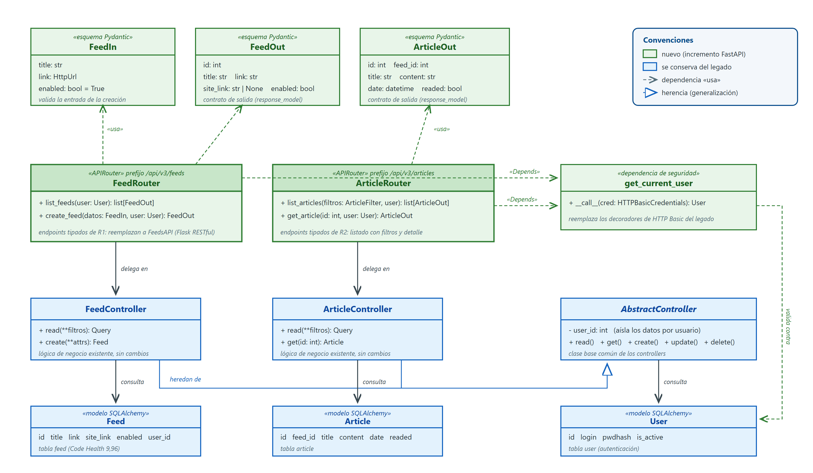
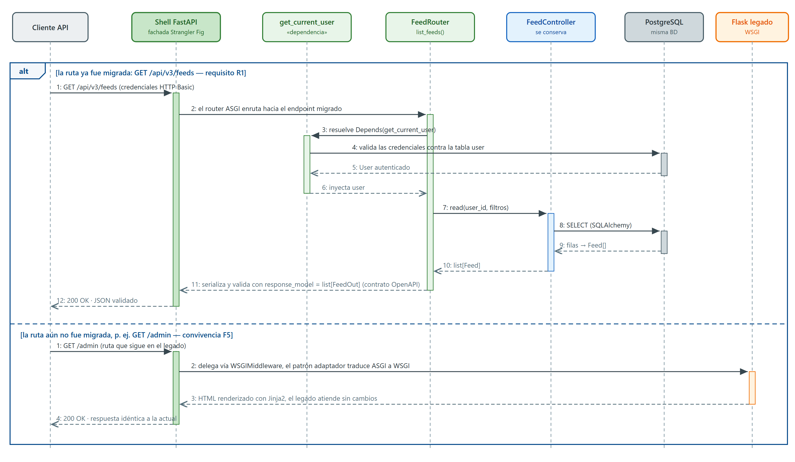

# Arquitectura to-be y experimento. Modernización de Newspipe

> Entrega final del proyecto. Modernización de software, semana 8.
> Grupo 9: Andrés Donoso, Germán Martínez, Jonatan Hernández, Daniel Corzo.
> Repositorio del código modernizado: https://github.com/ModernizacionGrupo9/newspipe

---

> **ESTADO DEL DOCUMENTO (interno del equipo, ELIMINAR ESTE BLOQUE ANTES DE ENTREGAR).**
> El detalle completo del progreso, cómo reproducir el experimento y el reparto de pendientes está en `docs/semana-8/progreso-experimento.md` de este repo.
>
> **TENEMOS:** arquitectura to-be con patrones y tácticas (sección 1), pre-experimento completo (sección 2), diseño detallado con 2 UML (sección 3), estimación con las preguntas orientadoras (sección 4), **experimento EJECUTADO con 16/16 verificaciones de paridad sobre PostgreSQL** y post-experimento completo con veredicto SÍ viable (sección 5).
>
> El código del experimento ya está publicado en el branch `experimento` del repo del equipo (commit `1819606`).
>
> **NOS FALTA:**
> 1. Validar la respuesta de Apigee contra los recursos del curso (sección 1.4, hoy es borrador).
> 2. Grabar el video de demostración y poner la URL (sección 7, guion en `docs/semana-8/guion-video-demostracion.md`, montaje en `EXPERIMENTO.md` de la raíz).
> 3. Corrida de CodeScene sobre el código nuevo (complementa la sección 5.1).
> 4. Verificar el post del tablero Thoughtworks de semana 5 (2 pts de la rúbrica).
> 5. Revisar las horas de esfuerzo real (sección 5.2), eliminar este bloque y exportar a PDF.

---

## 1. Arquitectura to-be

### 1.1 Diagrama de despliegue



*Figura 1. Diagrama de despliegue de la arquitectura to-be de Newspipe con los patrones y tácticas aplicados.*

### 1.2 Descripción de los elementos de arquitectura y sus interacciones

La arquitectura destino se despliega en tres nodos:

1. **Contenedor de la aplicación (Docker).** Corre un solo proceso servido por **Uvicorn** (servidor ASGI). Adentro conviven dos elementos:
   - El **shell de FastAPI**, que actúa como fachada del patrón Strangler Fig. Su router atiende de forma nativa los endpoints ya migrados (gestión de feeds y de artículos de la API v2), con esquemas Pydantic para validación de entrada y salida y documentación OpenAPI generada automáticamente.
   - El **Flask legado**, montado dentro del mismo proceso a través del **WSGIMiddleware** (adaptador ASGI a WSGI de `a2wsgi`). Toda ruta que aún no está migrada (interfaz web server-rendered, resto de la API) se delega a este componente sin modificarlo.

   La interacción entre ambos es la clave del patrón: la petición entra siempre por la fachada FastAPI. Si la ruta está migrada la atiende el router nativo, que reutiliza los controllers y modelos SQLAlchemy existentes. Si no lo está, la delega al Flask legado, que responde exactamente igual que hoy.

2. **Contenedor de PostgreSQL.** Es la **misma base de datos para el código migrado y el legado**, sin migración de datos. Los routers nuevos acceden a ella a través de los mismos modelos SQLAlchemy que usa el legado, lo que garantiza paridad funcional entre ambas rutas.

3. **Proceso batch del crawler.** Se conserva sin cambios porque la cartografía demostró que está sano (salud 9,16 en CodeScene). Sigue ejecutándose de forma periódica (`flask fetch_asyncio`) y escribe en la misma base de datos.

El legado se reduce endpoint a endpoint en incrementos sucesivos hasta desaparecer, sin big bang y con verificabilidad en cada paso.

### 1.3 Justificación de los patrones y tácticas

Los patrones y tácticas escogidos están alineados con el atributo de calidad degradado que identificamos con evidencia en la cartografía: la **mantenibilidad** (deuda concentrada en `common.py` con salud 7,71 y dueño inactivo desde 2016, `feed.py` como hotspot, y bus factor concentrado en una sola persona).

| Patrón o táctica | Tipo | Justificación |
| :--- | :--- | :--- |
| Strangler Fig | Patrón de modernización | Permite migrar de forma incremental sin big bang. Cada incremento es pequeño, verificable y reversible, lo que reduce el riesgo de la modernización |
| Adaptador (WSGIMiddleware) | Patrón de diseño | Integra el Flask legado dentro del proceso ASGI sin tocar su código. Lo no migrado sigue funcionando igual mientras avanza la migración |
| Fachada (shell FastAPI) | Patrón de diseño | Un único punto de entrada decide si la petición la atiende el código migrado o el legado. Los consumidores de la API no perciben la migración |
| Contratos tipados con Pydantic | Táctica de mantenibilidad | Reemplaza el parseo manual y artesanal de `common.py` (el peor archivo del sistema) por validación declarativa, eliminando la clase de complejidad que CodeScene marcó |
| Documentación OpenAPI generada | Táctica de mantenibilidad | El contrato de la API queda formalizado y siempre actualizado de manera automática, lo que reduce la dependencia del conocimiento de una sola persona (bus factor) |
| Base de datos única compartida | Táctica de integración | El código migrado y el legado leen y escriben los mismos datos, lo que garantiza paridad funcional sin sincronización ni migración de datos |

### 1.4 Prácticas de los recursos Apigee extrapolables a la arquitectura to-be

<!-- [PENDIENTE] BORRADOR: redactado a partir de prácticas generales de Apigee (gestión de APIs de Google Cloud).
     Hay que validarlo y ajustarlo contra los recursos Apigee específicos que dio el curso en esta semana. -->

De las prácticas observadas en los recursos de Apigee extrapolaríamos a nuestra arquitectura to-be las siguientes:

1. **El proxy de API como capa de mediación entre consumidores y backend.** Apigee separa la interfaz que ven los consumidores (proxy endpoint) de la implementación que la atiende (target endpoint). Es exactamente el rol de nuestra fachada FastAPI: los consumidores ven un único contrato estable mientras que por detrás la implementación cambia de Flask a FastAPI endpoint a endpoint. Esta separación es la que hace posible la migración sin interrumpir a los consumidores.

2. **Diseño de la API a partir de una especificación OpenAPI.** Apigee promueve el enfoque de contrato primero, donde la especificación OpenAPI es el artefacto central para diseñar, documentar y validar la API. En nuestra arquitectura el contrato OpenAPI se genera desde los esquemas Pydantic y ataca directamente la mantenibilidad degradada: formaliza el conocimiento que hoy vive solo en la cabeza del dueño del código.

3. **Centralización de políticas transversales en la capa de entrada.** En Apigee la seguridad, las cuotas y la transformación de mensajes se declaran como políticas en el proxy, no se programan en cada backend. Nosotros extrapolamos esa idea con la inyección de dependencias de FastAPI: la autenticación se declara una sola vez como dependencia y se aplica a todos los endpoints migrados, en lugar de repetir decoradores artesanales en cada recurso como hace el legado.

## 2. Pre-experimento

### 2.1 Propósito

El propósito del experimento es **evaluar la viabilidad técnica de la arquitectura destino y explorar la tecnología escogida**. Queremos comprobar que dos requisitos de la API v2 pueden reescribirse en FastAPI y operar detrás de la fachada Strangler Fig con paridad funcional sobre la misma base de datos, mejorando la mantenibilidad de forma medible y sin interrumpir el resto del sistema (interfaz web, resto de la API y crawler siguen funcionando por la ruta legada).

### 2.2 Requisitos

El grupo tiene 4 integrantes, por lo que n = 4 dividido 2 = **2 requisitos**. Ambos provienen de la tabla de funcionalidades de la entrega anterior y son independientes entre sí porque pertenecen a dominios distintos (feeds y artículos). La convivencia entre Flask y FastAPI (funcionalidad F5 de esa tabla) es la funcionalidad habilitante del patrón Strangler Fig y se valida de forma transversal, no como requisito propio.

**R1 (funcionalidad F1). Gestión de feeds por la API**

*Descripción:* listado y creación de feeds a través de la API (`GET /feeds` y `POST /feed`), migrados a FastAPI con esquemas Pydantic.

*Criterios de aceptación:*
1. Los endpoints `GET /feeds` y `POST /feed` operan en FastAPI y devuelven los mismos resultados que la API Flask legada sobre la misma base de datos (paridad funcional).
2. La validación de entrada y salida se hace vía esquemas Pydantic y sustituye el parseo manual de `common.py`.
3. La documentación OpenAPI de los endpoints se genera automáticamente.

**R2 (funcionalidad F2). Gestión de artículos por la API**

*Descripción:* listado de artículos con filtros y consulta por identificador (`GET /articles` y `GET /article/{id}`) en FastAPI.

*Criterios de aceptación:*
1. `GET /articles` con filtros y `GET /article/{id}` devuelven los mismos resultados que la API Flask legada sobre la misma base de datos.
2. El filtrado de atributos queda declarado en los esquemas Pydantic, no en código artesanal.
3. La documentación OpenAPI de los endpoints se genera automáticamente.

### 2.3 Descripción

#### 2.3.1 Tecnología y framework destino

La tecnología destino es **FastAPI** corriendo sobre un servidor **ASGI (Uvicorn)**. Sus elementos estructurales son:

- **Routers (`APIRouter`):** agrupan endpoints por dominio (un router de feeds, un router de artículos) y se montan en la aplicación principal. Cada endpoint es una función tipada con decorador HTTP.
- **Esquemas Pydantic (`BaseModel`):** declaran el contrato de entrada y de salida de cada endpoint. La validación y la serialización son declarativas y ocurren automáticamente.
- **Inyección de dependencias (`Depends`):** resuelve responsabilidades transversales como la autenticación una sola vez y las aplica a los endpoints que las declaran.
- **OpenAPI generado:** FastAPI produce la especificación OpenAPI y la interfaz Swagger UI a partir de los routers y esquemas, sin trabajo adicional.
- **WSGIMiddleware (`a2wsgi`):** adaptador que permite montar una aplicación WSGI (el Flask legado) dentro de la aplicación ASGI, habilitando la convivencia del patrón Strangler Fig.

#### 2.3.2 Mapeos entre el legado y lo modernizado

| Elemento del legado (Flask) | Elemento modernizado (FastAPI) | Cardinalidad | Descripción |
| :--- | :--- | :--- | :--- |
| Recursos de Flask-RESTful (`FeedsAPI`, `FeedNewAPI`, `ArticlesAPI`, `ArticleAPI`, en `web/views/api/v2/`) | Routers con endpoints tipados (`feeds_router`, `articles_router`) | Muchos a uno | Varias clases recurso del mismo dominio se consolidan en un solo router por dominio, con una función por endpoint |
| Parseo manual `reqparse_args()` de `common.py` | Esquemas Pydantic (`FeedIn`, `FeedOut`, `ArticleOut`) | Uno a muchos | Una única función genérica y artesanal se reemplaza por esquemas explícitos por recurso, donde el contrato queda declarado y visible |
| Decoradores de autenticación (`api_permission`, HTTP Basic) | Dependencia de seguridad (`Depends(get_current_user)`) | Muchos a uno | Los decoradores repetidos en cada recurso se centralizan en una sola dependencia declarativa |
| Controllers (`FeedController`, `ArticleController`) | Se reutilizan tal cual | Uno a uno | La lógica de negocio no se reescribe. Los routers nuevos delegan en los controllers existentes |
| Modelos SQLAlchemy (`Feed`, `Article`, `User`) | Se reutilizan tal cual | Uno a uno | El acceso a datos no cambia, lo que garantiza paridad funcional sobre la misma base de datos |
| Rutas no migradas (interfaz web, resto de la API) | Delegación vía `WSGIMiddleware` | Uno a uno | Cada ruta no migrada se atiende por el Flask legado sin cambios, a través del adaptador |

#### 2.3.3 Ejemplos de código legado y modernizado

**R1. Gestión de feeds.** En el legado, el recurso de Flask-RESTful no contiene la lógica de validación: la hereda de `common.py` (el archivo con peor salud del sistema, 7,71), donde `reqparse_args()` parsea y filtra los atributos por rol de forma manual.

Código legado (`newspipe/web/views/api/v2/feed.py` y `common.py`):

```python
class FeedNewAPI(PyAggResourceNew):
    controller_cls = FeedController

class FeedsAPI(PyAggResourceMulti):
    controller_cls = FeedController

api.add_resource(FeedNewAPI, "/feed", endpoint="feed_new.json")
api.add_resource(FeedsAPI, "/feeds", endpoint="feeds.json")

# La validacion vive en common.py: reqparse_args() parsea
# y filtra los atributos por rol de forma manual, para todos
# los recursos a la vez
```

Código modernizado (`newspipe/api_v3/schemas.py` y `newspipe/api_v3/feeds.py`, en el repositorio):

```python
class FeedIn(BaseModel):
    """Contrato para crear un feed (cuerpo del POST /feed)."""
    title: str
    link: str
    description: str = ""
    site_link: str = ""
    enabled: bool = True
    category_id: int | None = None

router = APIRouter(tags=["feeds"])

@router.get("/feeds", response_model=list[FeedOut])
def list_feeds(limit: int = 10, user: AuthUser = Depends(get_current_user)):
    with application.app_context():
        query = _controller(user).read()
        if limit:
            query = query.limit(limit)
        return [FeedOut.model_validate(feed) for feed in query]

@router.post("/feed", response_model=FeedOut, status_code=201)
def create_feed(feed: FeedIn, user: AuthUser = Depends(require_api_right)):
    with application.app_context():
        created = FeedController(user.id).create(**feed.model_dump())
        return FeedOut.model_validate(created)
```

El esquema `FeedIn` declara el contrato de entrada con sus valores por defecto y `FeedOut` el de salida, reemplazando el filtrado manual de atributos. El decorador `@router.get` expone la ruta ya documentada en OpenAPI. La dependencia `get_current_user` resuelve la autenticación HTTP Basic (la misma semántica del decorador `authenticate` del legado, declarada una sola vez). Y el controller existente hace el trabajo: la capa nueva es solo contrato y validación sobre la lógica que ya funciona. El bloque `application.app_context()` es el puente con la capa de datos del legado (Flask-SQLAlchemy), que necesita un contexto de aplicación Flask por petición.

**R2. Gestión de artículos.** El legado repite el mismo esquema de recursos que heredan de `common.py`:

Código legado (`newspipe/web/views/api/v2/article.py`):

```python
class ArticleAPI(PyAggResourceExisting):
    controller_cls = ArticleController

class ArticlesAPI(PyAggResourceMulti):
    controller_cls = ArticleController

api.add_resource(ArticleAPI, "/article/<int:obj_id>", endpoint="article.json")
api.add_resource(ArticlesAPI, "/articles", endpoint="articles.json")
```

Código modernizado (`newspipe/api_v3/articles.py`, en el repositorio):

```python
@router.get("/articles", response_model=list[ArticleOut])
def list_articles(
    feed_id: int | None = None,
    readed: bool | None = None,
    limit: int = 10,
    user: AuthUser = Depends(get_current_user),
):
    filters = {k: v for k, v in {"feed_id": feed_id, "readed": readed}.items()
               if v is not None}
    with application.app_context():
        query = _controller(user).read(**filters)
        if limit:
            query = query.limit(limit)
        return [ArticleOut.model_validate(article) for article in query]

@router.get("/article/{article_id}", response_model=ArticleOut)
def get_article(article_id: int, user: AuthUser = Depends(get_current_user)):
    with application.app_context():
        try:
            article = _controller(user).get(id=article_id)
        except NotFound:
            raise HTTPException(404, "Article not found")
        return ArticleOut.model_validate(article)
```

Los filtros del listado quedan declarados como parámetros tipados de la función (antes eran argumentos parseados a mano) y la consulta por identificador delega en el mismo `ArticleController` del legado.

**Convivencia (transversal).** El shell de la fachada (`asgi.py`, en el repositorio) monta ambos mundos en un solo proceso. Los routers migrados se publican bajo el mismo prefijo `/api/v2.0` del legado, de modo que los consumidores conservan sus URL sin enterarse de la migración:

```python
app = FastAPI(title="Newspipe API (Strangler Fig facade)")

# Endpoints migrados, atendidos nativamente por FastAPI
app.include_router(feeds_router, prefix=API_PREFIX)
app.include_router(articles_router, prefix=API_PREFIX)

# Todo lo no migrado se delega al Flask legado
app.mount("/", WSGIMiddleware(flask_app))
```

#### 2.3.4 Infraestructura computacional

La infraestructura es deliberadamente simple porque el experimento es de software, no de infraestructura. No usamos nube: la base de datos **PostgreSQL 16 corre en un contenedor Docker** (archivo `docker-compose-experiment.yml` del repositorio) y la aplicación corre en la misma máquina como dos procesos, el legado puro con Flask en el puerto 5000 (línea base de comparación) y la fachada modernizada con Uvicorn en el puerto 8000. Ambos procesos apuntan al mismo PostgreSQL (configuración `instance/experiment-postgresql.py`).



*Figura 2. Infraestructura computacional del experimento.*

- **Proceso de la fachada (puerto 8000):** Uvicorn sirviendo el shell FastAPI que envuelve el Flask legado. Es la aplicación parcialmente modernizada.
- **Proceso del legado puro (puerto 5000):** la aplicación Flask sin modificar. Sirve de línea base para las pruebas de paridad funcional.
- **Contenedor de PostgreSQL:** la misma base de datos para el legado y lo migrado, con los datos de prueba sembrados una sola vez (`seed_experiment.py`).

En la arquitectura to-be la aplicación también se empaqueta en un contenedor. Para el experimento la corrimos como procesos locales, una simplificación que no afecta la validez de la comparación porque lo que se evalúa es el software, no el empaquetado.

#### 2.3.5 Instrumentación y métricas

La instrumentación responde al atributo de calidad deseable, que es la **mantenibilidad**, y se complementa con la validación funcional de la convivencia:

| Tipo de prueba | Métrica | Cómo se recolecta |
| :--- | :--- | :--- |
| Pruebas de paridad funcional | Igualdad de respuestas (payload y códigos HTTP) entre el endpoint legado y el migrado para los mismos datos | Peticiones idénticas a ambas rutas comparando las respuestas |
| Métricas de mantenibilidad | Code health de CodeScene del código nuevo frente al legado (referencia: `common.py` 7,71), líneas de código por endpoint, complejidad | Nueva corrida de CodeScene sobre el repositorio con el incremento FastAPI (cumple el rol que el enunciado ilustra con SonarQube) |
| Prueba de convivencia | Las rutas no migradas (interfaz web, resto de la API) responden igual que antes a través de la fachada | Smoke test manual y peticiones HTTP a rutas legadas atravesando el shell FastAPI |
| Contrato formalizado | Existencia y completitud de la especificación OpenAPI generada para R1 y R2 | Inspección de `/docs` y del JSON OpenAPI generado |

El desarrollo de pruebas exhaustivas está fuera del alcance del experimento: el alcance acordado es el camino feliz de R1 y R2. La instrumentación quedó materializada en el script `parity_check.py` del repositorio, que automatiza 16 verificaciones de paridad, scoping, convivencia y contrato (los resultados se reportan en el post-experimento).

#### 2.3.6 Interesados

- **Equipo de desarrollo:** ejecuta el experimento y evalúa la experiencia de desarrollo con la tecnología destino.
- **Arquitecto de software:** valida que el patrón Strangler Fig y las tácticas funcionan como se diseñaron.
- **Dueño del producto:** le interesa que la migración no interrumpa la operación ni cambie el comportamiento visible.
- **Consumidores de la API:** son quienes perciben la paridad funcional y se benefician del contrato OpenAPI documentado.

## 3. Diseño detallado

Incluimos dos diagramas de diseño detallado, distintos de los diagramas de componentes y de despliegue de nivel de arquitectura.

### 3.1 Diagrama de clases UML del incremento FastAPI



*Figura 3. Diagrama de clases UML del incremento FastAPI.*

En verde está lo nuevo: los **routers** de feeds y de artículos, que exponen los endpoints tipados de los dos requisitos; los **esquemas Pydantic**, que declaran el contrato de entrada y de salida y reemplazan el parseo manual de `common.py`; y la **dependencia de seguridad**, que valida las credenciales. En azul está lo que se conserva sin cambios: los **controllers**, que heredan de un controlador abstracto y concentran la lógica de negocio, y los **modelos SQLAlchemy**. La relación clave es que los routers delegan en los controllers existentes: el diseño nuevo es una capa delgada de contrato y validación sobre la lógica que ya funciona.

### 3.2 Diagrama de secuencia UML de R1 con la convivencia



*Figura 4. Diagrama de secuencia de una petición del requisito R1 atravesando la fachada Strangler Fig, con la rama alternativa de convivencia.*

La petición llega a la fachada Strangler Fig. Si la ruta ya está migrada, el router ASGI la atiende: resuelve la dependencia de autenticación contra la tabla de usuarios, invoca al `FeedController`, que consulta PostgreSQL con SQLAlchemy, y la respuesta se serializa y valida con el esquema `FeedOut` del contrato OpenAPI. La rama alternativa muestra la convivencia: una ruta no migrada se delega al Flask legado a través del WSGIMiddleware y responde exactamente igual que hoy. El mismo flujo aplica al requisito R2 con artículos.

## 4. Estimación de esfuerzo

### 4.1 Unidad seleccionada y justificación

Estimamos en **puntos de historia con escala Fibonacci**, no en puntos de función, por dos razones. Primera, el equipo estima mejor en relativo y por consenso: comparar tareas entre sí es más natural que medirlas en una unidad absoluta. Segunda, los puntos de función exigen contar transacciones y ficheros lógicos con una calibración histórica que el equipo no tiene, y sin esa calibración el número resultante no sería más confiable que la estimación relativa. Además, el post-experimento pide comparar contra el esfuerzo real en horas, y esa comparación es natural con puntos de historia.

**¿Cuál técnica ágil preferimos para estimar: analogía, desagregación o juicio de expertos?** Preferimos la combinación de **desagregación con juicio de expertos**: primero descomponemos la modernización en tareas pequeñas y comparables (la fachada, cada requisito, la infraestructura, la instrumentación) y luego cada integrante asigna puntos por consenso al estilo planning poker. La analogía la usamos solo de apoyo, porque el equipo no tiene un historial de migraciones Flask a FastAPI comparables que sirva de referencia directa. La desagregación reduce el sesgo de optimismo de estimar el proyecto como un todo, y el juicio de expertos por consenso hace visibles los supuestos distintos de cada integrante antes de fijar el número.

**¿Hemos clasificado las funciones del software en términos de datos y transacciones? ¿Ventajas y desventajas de ese método de estimación de tamaño?** En este proyecto no aplicamos esa clasificación, que corresponde al método de puntos de función. Sus ventajas: es una medida de tamaño objetiva e independiente de la tecnología, permite comparar proyectos y equipos distintos, y está estandarizada (IFPUG/ISO), por lo que sirve para contratos y benchmarking. Sus desventajas: exige una calibración histórica y entrenamiento que el equipo no tiene, el conteo es costoso y lento para un experimento corto, y captura mal el esfuerzo de tareas técnicas propias de una modernización (montar la fachada Strangler Fig o el adaptador WSGI no crea funciones nuevas visibles para el usuario, pero es donde está la mayor incertidumbre técnica).

### 4.2 Estimación

| Tarea o requisito | Puntos de historia | Justificación del tamaño |
| :--- | :--- | :--- |
| T1. Fachada Strangler Fig (shell FastAPI + WSGIMiddleware envolviendo el Flask legado) | 8 | Es la tarea de mayor incertidumbre técnica: contexto de aplicación Flask y sesión SQLAlchemy invocados desde FastAPI |
| R1. Gestión de feeds en FastAPI (listado y creación) | 5 | Reescritura de endpoints con esquemas Pydantic reutilizando `FeedController` |
| R2. Gestión de artículos en FastAPI (listado con filtros y consulta por id) | 5 | Análogo a R1 sobre `ArticleController`, con filtros declarados en el contrato |
| T2. Infraestructura con Docker Compose | 3 | Partimos del compose existente del proyecto, solo se ajusta el proceso de arranque a Uvicorn |
| T3. Instrumentación (paridad funcional, corrida de CodeScene, prueba de convivencia) | 5 | Comparación de respuestas legado contra migrado y análisis de métricas |
| **Total** | **26** | |

## 5. Post-experimento

### 5.1 Recomendaciones

**SÍ, la arquitectura to-be y su implementación hacen que la modernización sea viable desde el punto de vista técnico.** La justificación se apoya en los resultados del experimento:

1. **Paridad funcional verificada.** Las 16 verificaciones automatizadas del script `parity_check.py` pasaron (evidencia en `resultados/paridad-postgresql.txt`): los endpoints migrados de R1 y R2 devuelven el mismo payload campo a campo y los mismos códigos de estado que el legado, sobre la misma base de datos PostgreSQL. La creación de feeds funciona por ambas rutas y el objeto creado por una es visible de inmediato por la otra (base de datos única, sin sincronización). El scoping por usuario se conserva: un usuario no admin ve exactamente lo mismo por la ruta legada y por la moderna, y nunca los datos de otros.

2. **Convivencia total del patrón Strangler Fig.** Las rutas no migradas (la interfaz web y el resto de la API v2) se delegan al Flask legado a través del WSGIMiddleware y responden igual que hoy. La convivencia resultó incluso más fina de lo diseñado: es por método HTTP y no solo por ruta. Un `PUT /api/v2.0/article/1` (operación no migrada de una ruta cuyo `GET` sí está migrado) atraviesa la fachada y lo atiende el legado, porque el enrutador ASGI prefiere la coincidencia completa del montaje del legado sobre la coincidencia parcial (ruta sin método) del router migrado.

3. **El contrato OpenAPI se genera solo.** Los 4 endpoints migrados quedan documentados automáticamente en `/docs`, algo que el legado no ofrece por ninguna vía.

4. **El costo de entrada es bajo.** El incremento completo son 279 líneas nuevas (paquete `api_v3` más el shell `asgi.py`) sin modificar una sola línea del legado. Como referencia, solo `common.py`, el archivo que el código migrado deja de necesitar, tiene 239 líneas con la peor salud del sistema (7,71).

**Desviaciones observadas frente a lo esperado:**

- **El riesgo técnico previsto (contexto de aplicación Flask desde FastAPI) se materializó, pero de forma manejable.** FastAPI puede ejecutar las dependencias y el cuerpo del endpoint en hilos distintos y el contexto de Flask es local al hilo, así que no basta un contexto por petición: cada dependencia y cada endpoint abren su propio `application.app_context()`. Era la incertidumbre que justificó los 8 puntos de la fachada y se resolvió con el patrón estándar.
- **El contrato informal del legado quedó en evidencia durante las pruebas.** El `GET` de colecciones del legado exige un cuerpo JSON (o query args) y responde con errores crípticos si falta el `Content-Type`, y el `POST /feed` legado exige todos los campos de la whitelist en el cuerpo. La fachada solo pide `title` y `link` y el resto son valores por defecto declarados en el esquema. Es una confirmación directa del problema de mantenibilidad que motivó la modernización.
- **Simplificación de infraestructura.** La aplicación corrió como procesos locales y solo la base de datos en contenedor (el to-be empaqueta también la aplicación). No afecta la conclusión porque el experimento evalúa el software.
- **Consideración de despliegue.** El legado activa redirección forzada a HTTPS (Flask-Talisman) fuera del modo debug. En un despliegue real la fachada debe terminar TLS o ajustar esa política.

**Recomendaciones:** continuar la migración endpoint a endpoint priorizando los que dependen de `common.py` (categorías y el resto de operaciones de feeds y artículos), empaquetar la fachada en la imagen Docker del proyecto, incorporar `parity_check.py` a la integración continua como red de seguridad de cada incremento, y correr CodeScene sobre cada incremento para vigilar que el código nuevo mantenga la salud.

### 5.2 Esfuerzo real

El experimento completo tomó cerca de 2 horas de trabajo dirigido, con apoyo de IAG en las tareas mecánicas.

| Tarea o requisito | Puntos estimados | Horas reales | Comentario |
| :--- | :--- | :--- | :--- |
| T1. Fachada Strangler Fig | 8 | 0,5 | El riesgo del contexto Flask se resolvió con el patrón estándar (contexto explícito por dependencia y endpoint). Incluyó diagnosticar la redirección HTTPS de Talisman |
| R1. Gestión de feeds en FastAPI | 5 | 0,25 | Por debajo: los controllers y modelos se reutilizaron tal cual, el router es una capa delgada |
| R2. Gestión de artículos en FastAPI | 5 | 0,25 | Análogo a R1, el patrón ya estaba establecido |
| T2. Infraestructura (venv, Docker Compose con PostgreSQL, semilla de datos) | 3 | 0,5 | Acorde. Incluyó la doble corrida: primero se validó sobre SQLite y luego sobre PostgreSQL |
| T3. Instrumentación (script de paridad, corridas, evidencia) | 5 | 0,5 | Por debajo: el script de 16 verificaciones quedó automatizado y reproducible. La corrida de CodeScene sobre el código nuevo queda pendiente en el tablero del equipo y no bloquea la conclusión |
| **Total** | **26** | **2,0** | |

El esfuerzo real quedó muy por debajo de la estimación (unos 8 minutos por cada punto estimado) por tres razones: la reutilización total de los controllers y modelos del legado redujo cada requisito a declarar contratos; el apoyo de IAG aceleró las tareas mecánicas (escritura de código repetitivo, scripts de verificación y depuración guiada); y el alcance acordado fue el camino feliz. La estimación de 8 puntos de la fachada asumía que la incertidumbre del contexto Flask podía consumir mucho tiempo de depuración, pero la solución estándar funcionó a la primera. Con todo, la relación entre tareas se mantuvo: la fachada y la instrumentación fueron efectivamente las tareas más largas, que es lo que los puntos de historia relativos pretenden capturar.

## 6. Enlace del repositorio del código modernizado

Repositorio público: https://github.com/ModernizacionGrupo9/newspipe

El código del experimento está en el branch `experimento`: https://github.com/ModernizacionGrupo9/newspipe/tree/experimento

Los artefactos del experimento dentro del repositorio son: el paquete `newspipe/api_v3/` (esquemas, dependencia de autenticación y los routers de R1 y R2), el shell de la fachada `asgi.py`, la infraestructura `docker-compose-experiment.yml` y `instance/experiment-postgresql.py`, la semilla de datos `seed_experiment.py`, las verificaciones `parity_check.py` y la guía de ejecución `EXPERIMENTO.md`.

## 7. Video de demostración

[PENDIENTE. URL del video que muestra en ejecución R1 y R2 en el legado y su correspondencia en lo modernizado, con descripción oral detallada. Se sube a YouTube en modo oculto. El guion escena por escena está en `docs/semana-8/guion-video-demostracion.md` y el montaje previo en `EXPERIMENTO.md` de la raíz del repositorio.]

## 8. Uso de IA generativa (IAG)

**¿Se hizo uso de IAG?**
Sí, de manera dirigida: nosotros definimos el alcance (dos requisitos, camino feliz), suministramos los insumos (las entregas anteriores del proyecto, la cartografía de CodeScene, el enunciado y la rúbrica) y validamos cada resultado, y la IAG ejecutó bajo nuestras instrucciones.

**¿Qué herramientas de IAG se usaron?**
Claude (Anthropic), a través de la interfaz de Claude Code.

**¿En qué partes del entregable se usó la IAG?**
- Consolidación y redacción de este documento a partir del material que ya habíamos elaborado en las entregas y el video de avance (arquitectura to-be, pre-experimento, diseño detallado y estimación).
- Generación de las figuras del despliegue to-be y de los diagramas UML de clases y de secuencia, a partir del diseño que definimos.
- Implementación del incremento FastAPI que diseñamos (el paquete `api_v3`, el shell de la fachada y la semilla de datos), reutilizando los controllers y modelos del legado según el mapeo definido en el pre-experimento.
- Construcción y ejecución del script de verificación de paridad (`parity_check.py`) según la instrumentación que planteamos, y apoyo en el diagnóstico de los hallazgos técnicos (la redirección HTTPS de Talisman y el contexto de aplicación Flask por hilo).

La definición de la estrategia de modernización, la selección de los requisitos, el diseño de la arquitectura, la estimación por consenso, la ejecución supervisada del experimento y la validación de cada sección contra la rúbrica fueron trabajo directo del equipo.

**¿Identificó algún sesgo u omisión en los resultados de la IAG? Explique.**
Sí. Durante la verificación, una de las 16 comprobaciones automatizadas marcó una falla que no era del sistema sino un supuesto del script generado por la IAG (asumía una base de datos recién sembrada y la corrida de evidencia se hizo sobre una base con datos de corridas previas). Lo detectamos revisando la evidencia, pedimos la corrección y la verificación quedó idempotente. También hemos observado la tendencia de la IAG a agregar información no solicitada o formatos propios, que controlamos exigiendo el esquema de las entregas anteriores del curso.

**¿Son confiables y pertinentes los resultados de la IAG? Explique.**
Son confiables en la medida en que se validan contra fuentes verificables: el código del experimento se probó con 16 verificaciones automatizadas y reproducibles sobre la aplicación real, los fragmentos de código legado citados provienen del repositorio y las cifras de la cartografía provienen de nuestra corrida de CodeScene. Ninguna afirmación del documento se integró sin contrastarla contra esas fuentes.

**¿Los resultados de la IAG se integraron sin modificación o los estudiantes debieron intervenirlos? Explique.**
Debimos intervenirlos. Además de la corrección del script de verificación ya mencionada, dirigimos los ajustes de alcance (los requisitos correctos según la regla n = integrantes/2, la cardinalidad de los mapeos que pedía la rúbrica), corregimos redacción y formato para mantener el esquema de los entregables del curso, y decidimos las desviaciones a reportar en el post-experimento. La IAG ejecuta, pero la dirección y la validación final son nuestras.
